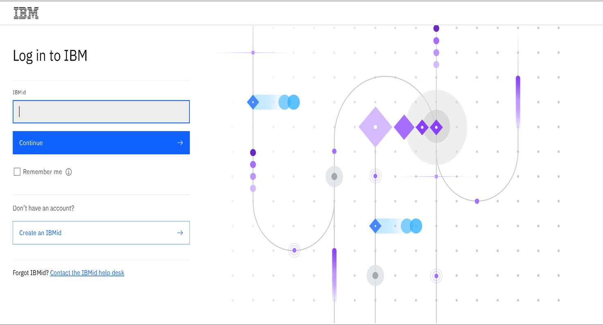
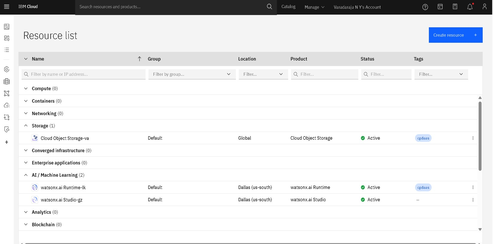
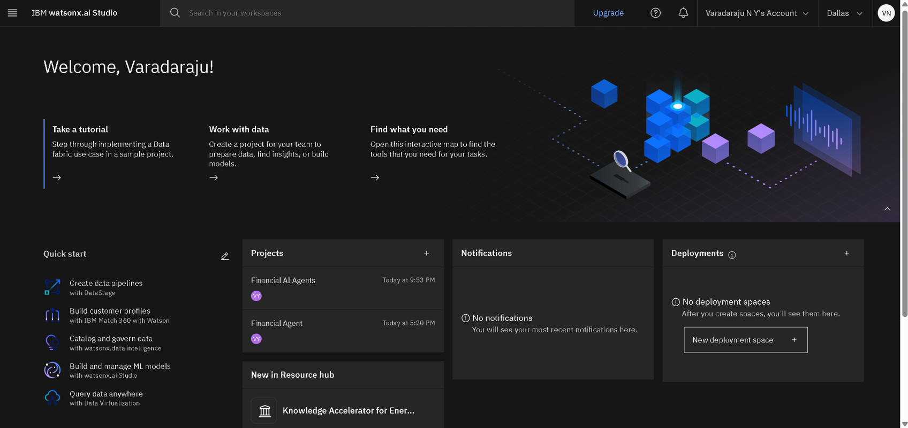
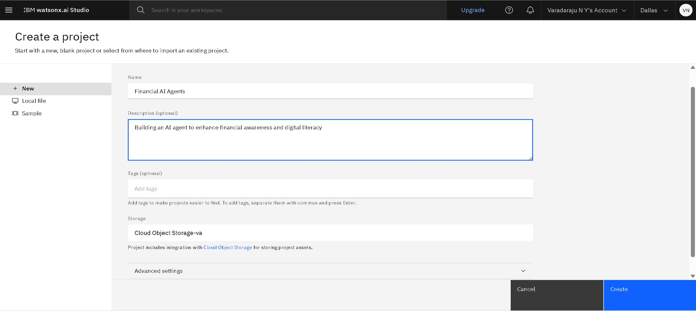
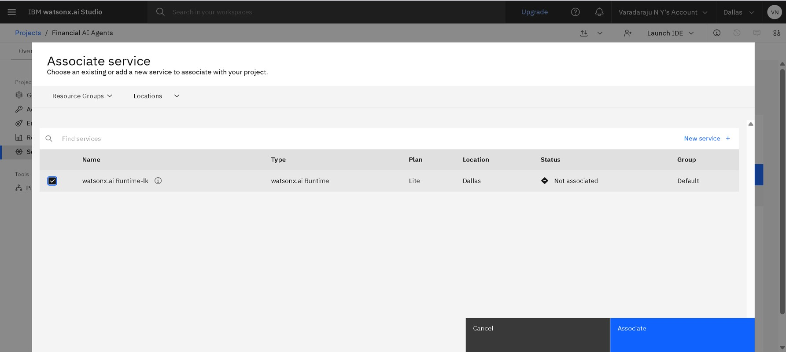
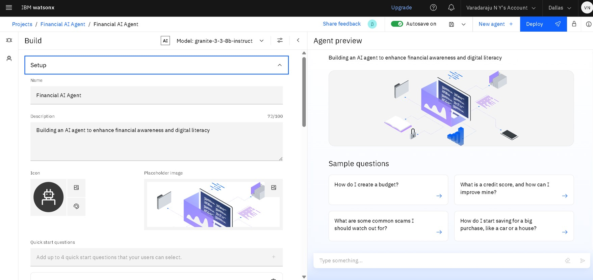
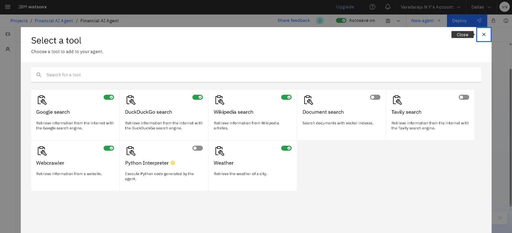
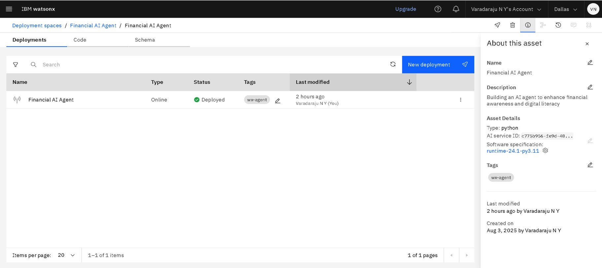
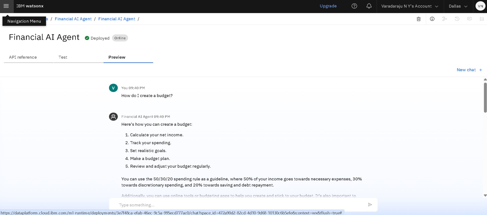
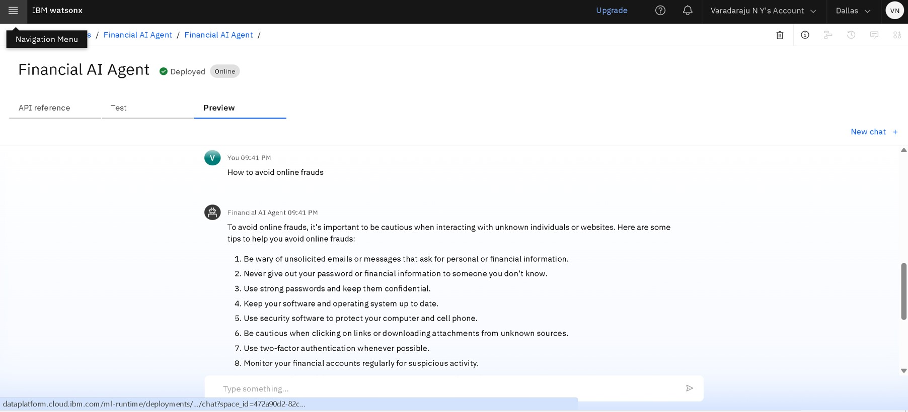

# 💬 Digital Financial Literacy AI Agent  
**Empowering Safe & Informed Financial Decisions**

An AI-powered assistant that helps users securely navigate digital finance. Built on IBM Watsonx.ai with Retrieval-Augmented Generation (RAG), it provides multilingual, evidence-based guidance on:
- UPI transactions & security 🔒
- Personal budgeting & savings 📊
- Investment strategies & stock market 📈
- Loan safety & interest rates 💰
- Fraud prevention & scam detection 🛡️
- Digital banking best practices 🏦

---

## 🧩 Problem Statement

**Critical financial literacy gaps exist**, particularly in rural and underserved communities:
- High vulnerability to UPI fraud and online scams
- Limited understanding of digital banking operations
- Lack of investment knowledge and financial planning
- Difficulty comprehending interest rates and loan terms
- Digital exclusion due to technological barriers

> *Consequences:* Financial fraud, poor money management, exclusion from digital economy

---

## 💡 Proposed Solution

**An AI financial advisor** leveraging IBM Watsonx.ai to deliver:
- Document-grounded answers using RBI/NPCI PDF sources
- Multilingual support for inclusive accessibility
- Real-time scam detection and prevention guidance
- Personalized financial education pathways
- Safe, regulated financial recommendations
---

## 🧠 Technologies Used

- IBM Watsonx.ai Studio
- IBM Granite Foundation Model (LLM)
- Vector Index for Retrieval-Augmented Generation
- PDF documents from RBI/NPCI & other related sourses
- NLP (Natural Language Processing)
- IBM Cloud Object Storage

---

## ☁️ IBM Cloud Services Used

- Watsonx.ai Studio
- IBM Granite Model
- Watsonx Vector Index
- IBM Cloud Lite Account
- IBM Cloud IAM
- IBM Cloud Object Storage

---

## 👥 End Users

- General public seeking financial clarity  
- Rural and semi-urban citizens  
- Students and young professionals  
- First-time UPI and digital banking users  
- NGOs and government outreach programs  
- Customer service centers
- Self-Help Groups / Women’s Collectives
- Educators / Institutions

---

## 🌟 WOW Factors

- Uses RAG to fetch answers from real RBI/NPCI or uploaded PDFs  
- Built entirely on IBM Cloud using Watsonx tools  
- Handles unrelated questions with polite redirection  
- Future-ready with multilingual support  
- Educates users on scams, interest rates, budgeting, stock market, UPI, and more  
- Provides safe and personalized financial guidance

---

## 🧪 Key Features

1. Document-Verified Q&A
 → Vector Index retrieval from RBI/NPCI PDF sources

2. Financial Fraud Shield
 → Real-time scam detection algorithms

3. Multilingual Financial Coach
 → Native support for 13 Indian languages

4. Personal Finance Assistant
 → Budget planning • Investment advice • Debt management

5. Context Boundary Enforcement
 → Polite redirection of non-financial queries

6. UPI Security Specialist
 → Transaction safety • PIN management • Dispute resolution

---

## 🚀 How It Works

1. User Query        → "How to detect UPI scam messages?"
2. Watsonx.ai        → Processes query using Granite LLM
3. Vector Index      → Searches RBI fraud prevention PDFs
4. Document Retrieval → Extracts relevant regulatory guidance
5. Response Generation → Combines LLM + document evidence
6. User Response     → "According to RBI circular RPCD.CO.RF.BC.No.07/07.38.01/2023: 
                       • Verify sender IDs 
                       • Never share OTPs 
                       • Check https://www.rbicams.rbi.org.in for scam alerts"

---

## 🖼️ Steps of Project
### 🔹 Step 1:Login to IBM Cloud...

---
### 🔹 Step 2: Setting up the resources...

---
### 🔹 Step 3: Open the IBM Wastonx.ai Studio Page...

---
### 🔹 Step 4: Create An AI Agent Project in IBM Wastonx.ai Studio...

---
### 🔹 Step 5: Creating Associate Service Project in IBM Wastonx.ai Studio...

---
### 🔹 Step 6: Build and Setup the AI Agent Project in IBM Wastonx.ai Studio...

---
### 🔹 Step 7: Adding Tools for AI Agent Project in IBM Wastonx.ai Studio...

---
### 🔹 Step 8: Adding Granite Model for AI Agent Project in IBM Wastonx.ai Studio...

---
### 🔹 Step 9: Adding Deployment Space for AI Agent Project in IBM Wastonx.ai Studio...

---
### 🔹 Step 10: Deploying the AI Agent Project in IBM Wastonx.ai Studio...

---
### 🔹 Step 11: Deployed Results and Preview of the AI Agent Project in IBM Wastonx.ai Studio...

---

## 📌 How to Run or Deploy

1. Log in to IBM Cloud Lite: https://cloud.ibm.com
2. Launch Watsonx.ai Studio
3. Create a new AI Agent
4. Upload financial PDFs to a Vector Index
5. Choose Tools for web search (Google,Wikipedia,DuckDuckGo etc..)
6. Configure agent instructions and topics (restricting AI from answering off-topic questions politely)
7. Test in the preview panel
8. Deploy via web snippet, Streamlit, or custom web UI

---

## 🛣️ Future Scope

- WhatsApp or mobile app integration  
- Speech-to-text input for voice-driven queries  
- Automatic monthly report generation  
- Region-specific financial policy updates  
- Multilingual expansion with Watson Language Translator

---

## 🔗 Useful Links

- [IBM Cloud Lite](https://cloud.ibm.com/registration)
- [IBM Watsonx.ai](https://www.ibm.com/products/watsonx-ai)
- [RBI Official Website](https://www.rbi.org.in)
- [NPCI FAQs](https://www.npci.org.in/what-we-do/upi/faqs)
- [IBM SkillsBuild](https://skillsbuild.org)

---

## ⚖️ License

This project is licensed under the [MIT License](LICENSE).

---

🔗 [Connect with me on LinkedIn](https://www.linkedin.com/in/varadarajuny/)

---

> Created with 💙 during the IBM SkillsBuild for Academia Internship 2025 by **Shiva Pandala**
